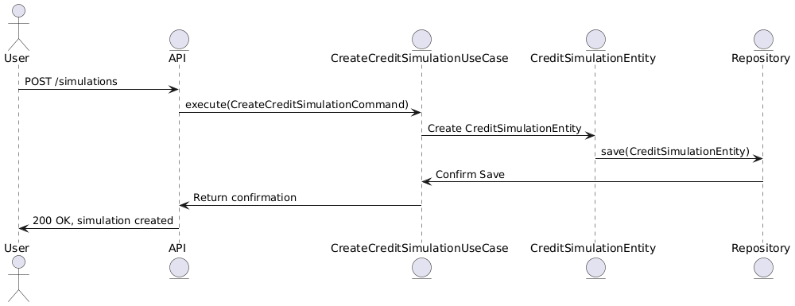

# Simulador de Crédito

## Tecnologias Usadas

- **Java 21**
- **Spring Boot**
- **PostgreSQL 15**
- **Docker Compose**
- **JUnit 5 para testes**

## Configuração do Projeto

### Pré-requisitos

1. **Docker e Docker Compose**: Necessário para subir a aplicação e o banco de dados PostgreSQL.
    - Instalar o Docker
    - Instalar o Docker Compose

2. **Java 21**: O projeto foi desenvolvido utilizando Java 21. Verifique a instalação:
   ```bash
   java -version
   ```

### Clonando o Repositório

```bash
git clone https://github.com/seu-usuario/simulador-de-credito.git
cd simulador-de-credito
```

### Configuração e Execução

1. **Subindo a Aplicação com Docker Compose**:

   ```bash
   docker-compose up -d
   ```

   Isso irá subir dois serviços:
    - Banco de Dados PostgreSQL (porta 5432)
    - Aplicação Java (porta 8080)

2. **Credenciais do Banco de Dados**:
    - **Usuário**: `root`
    - **Senha**: `root`
    - **Database**: `loansimulationdb`

### Acessando a Aplicação

- **Aplicação**: `http://localhost:8080`
- **Swagger UI**: `http://localhost:8080/swagger-ui/`

### Testes

Executar testes:
```bash
./gradlew test
```

### Exemplo de Request

#### POST - Criar Simulação de Crédito

Payload para `/simulations`:

```json
{
  "valorSolicitado": 9499.1,
  "dataNascimento": "1973-06-26",
  "prazoPagamento": 30,
  "tipoEmprestimo": "FIXED_INSTALLMENT", 
  "nome": "Gael Henrique Martins",
  "email": "jda-luz@example.net"
}
```

Resposta esperada:
```json
"8f9946a6-f09f-4c20-bfda-2852adb14b51"
```

#### POST - Processamento em Lote

Payload para processamento em lote (máximo 100 registros):

```json
[
  {
    "valorSolicitado": 12576.72,
    "dataNascimento": "1973-10-04",
    "prazoPagamento": 48,
    "tipoEmprestimo": "FIXED_INSTALLMENT",
    "nome": "Srta. Bianca Mendes",
    "email": "davi92@example.org"
  },
  {
    "valorSolicitado": 15000.5,
    "dataNascimento": "1980-05-12",
    "prazoPagamento": 36,
    "tipoEmprestimo": "FIXED_INSTALLMENT",
    "nome": "Carlos Eduardo Silva",
    "email": "carlos.edu@example.com"
  }
]

```
# Escolha de Arquitetura

Neste projeto, foi optado pela **arquitetura limpa** (clean architecture) e a abordagem de **"screaming architecture"**. Essa escolha foi motivada por alguns fatores:

## Arquitetura Limpa

A arquitetura limpa nos permite separar as responsabilidades entre as camadas, facilitando a manutenção, escalabilidade e testabilidade.

## Arquitetura "Screaming"

- **Clareza do Domínio**: A estrutura do projeto reflete diretamente o domínio.
- **Facilidade de Navegação**: A organização do código segue a lógica do negócio.
- **Comunicação Efetiva**: A arquitetura "grita" o propósito e o domínio do sistema.

A Funcionamento de dois casos de uso está detalhad nos diagramas a seguir:

- 
- 

- Foi utlizado patterns de Strategy e Factory para a criação de empréstimos e captura da taxa de emprestimos.
- Foi utilzado o Notification Pattern para notificar quando conter erro na validação de dados.

